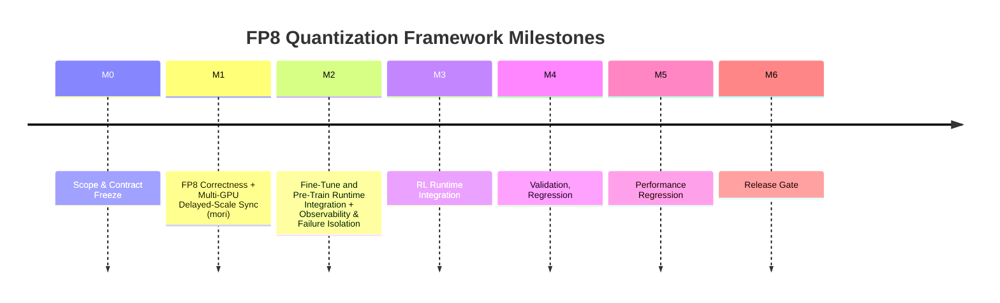
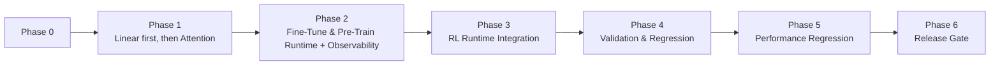

# FP8 Quantization Management Framework Plan

## 0) Project Overview (Visual)

### Roadmap (Milestone Timeline)

### Low-Risk Execution Order (Critical Path)

### Phase Dashboard

| Phase | Milestone | Goal | Exit Criteria (Summary) |
|---|---|---|---|
| 0 | M0 | Lock boundaries and contracts | Design doc approved + config schema versioned |
| 1 | M1 | Single-GPU correctness + cross-rank delayed-scale sync | No NaN/Inf, reproducible runs, no divergence, comm within budget |
| 2 | M2 | Fine-Tune/Pre-Train runtime integration + failure isolation | FT/PT config-only switching + diagnosable failures |
| 3 | M3 | RL runtime integration | RL flow runs with same runtime API and stable trend |
| 4 | M4 | Validation and numerical regression | Regression matrix passes within quality thresholds |
| 5 | M5 | Performance regression | Throughput/memory/comm metrics within budget |
| 6 | M6 | Release gate | All gates green + release checklist signed off |

---

## Functional Testing (Cross-Phase)

### Objectives
- Validate correctness of quantization behavior across all milestones (M0–M6).
- Ensure feature parity and stable task behavior when switching BF16 ↔ FP8.

### Functional Coverage
- Quantization config validation: schema, defaults, and invalid-input handling.
- Quant/dequant lifecycle validation for parameters, gradients, and activations.
- Runtime hook validation: forward/backward/optimizer-step start/end callbacks.
- Communication adapter validation: `all_reduce_amax`, `sync_delayed_scale`, `barrier`.
- Fallback-path validation: BF16 fallback, last-global-scale fallback, local-scale fallback.

### Test Matrix
- Modes: Pretrain / Finetune / RL.
- Topologies: single GPU and multi-GPU (2+ ranks).
- Precision configs: BF16 baseline vs FP8 with delayed-scale on/off.
- Fault scenarios: comm delay/failure simulation and operator fallback triggers.

### Acceptance Thresholds (Suggested)
- No correctness regressions against BF16 reference on fixed-seed runs.
- No NaN/Inf introduced by quantization flow in smoke and integration tests.
- Deterministic behavior under repeated runs with the same seed and config.
- All fallback paths execute as designed and emit required telemetry/logging.

---

## Performance Testing (Cross-Phase)

### Objectives
- Establish a unified BF16 vs FP8 performance baseline covering throughput, latency, memory, and communication overhead.
- Fix test environment and random seed to ensure cross-commit comparability.

### KPI Metrics
- Throughput: samples/s.
- Step Time: forward/backward/optimizer breakdown.
- Memory: peak VRAM, parameter/activation/optimizer-state footprint.

### Test Matrix
- Scenarios: Pretrain / Finetune / RL.
- Parallel scale: 1 GPU, 2+ GPUs.
- Config dimensions: BF16, FP8 (delayed-scale on/off), mori sync on/off.
- Batch dimensions: at least small / medium / large micro-batch tiers.

### Acceptance Thresholds (Suggested)
- FP8 vs BF16: no throughput regression, or meets predefined minimum gain targets.
- Memory usage: achieves expected reduction target (thresholds defined by model scale).
- Communication overhead: within budget, without unacceptable tail latency.
- Result stability: performance variance stays within acceptable bounds under fixed seed.

---

## Phase 0 — Scope and Contract Freeze (M0)

**Goal:** Lock boundaries before implementation.

### Checklist
- [x] Define ownership: quantization control plane only.
- [x] Confirm non-ownership:
- [x] Write interface contracts for:
	- [x] Quantization policy API.
	- [x] Operator dispatch API.
	- [x] Communication adapter API (mori for delayed scale only).
- [x] Define success metrics:

---

## Phase 1 — FP8 Correctness + Multi-GPU Delayed-Scale Sync (M1)

**Goal:** Build a stable FP8 pipeline from single-GPU correctness to multi-GPU delayed-scale synchronization.

### Checklist (Single-GPU FP8 Correctness)
- [x] Extend quant config (`lumen/quantize/config.py`):
	- [x] FP8 format.
	- [x] Delayed scale window.
	- [x] Amax history length.
	- [x] Overflow policy.
	- [x] Per-tensor / per-block / MXFP8.
- [x] Implement scale states in `scaling_manager.py`:
	- [x] Parameter scale state.
	- [x] Gradient scale state.
	- [x] Activation scale state.
- [x] Implement delayed-scale local update logic.
- [x] Implement parameter quant lifecycle in `fp8_param.py`.
- [x] Implement gradient quantization in `core/grad_quant.py`.
- [x] Add dispatch path in `modules/quantize.py`.
- [x] Add AITER call wrappers + BF16 fallback:
	- [x] `ops/quantize/linear.py`.
	- [x] `ops/attention/attention.py`.
- [ ] Add deterministic unit tests with fixed seed.

### Debug Checklist (Single-GPU)
- [ ] Compare FP8 vs BF16 loss curves.
- [ ] Track layer-wise amax/scale histograms.
- [ ] Track overflow/underflow counters.
- [ ] Validate grad cosine similarity vs BF16.
- [ ] Benchmark single-GPU throughput/step-time/memory vs BF16 baseline.

### Exit Criteria (Single-GPU)
- [ ] No NaN/Inf in smoke training.
- [ ] Stable loss trend close to BF16 baseline.
- [ ] Reproducible results across repeated runs.

---

### Checklist (Multi-GPU Delayed-Scale Sync)
- [ ] Add comm adapter package:
	- [ ] `lumen/comm/__init__.py`.
	- [ ] `lumen/comm/mori_adapter.py`.
- [ ] Implement adapter methods:
	- [ ] `all_reduce_amax`.
	- [ ] `sync_delayed_scale`.
	- [ ] `barrier`.
- [ ] Insert sync points in:
	- [ ] `models/fsdp.py`.
	- [ ] `models/megatron.py`.
- [ ] Align sync timing with grad accumulation/micro-batch boundaries.
- [ ] Add comm fault handling:
	- [ ] Fallback to last global scale.
	- [ ] Fallback to local scale.
	- [ ] Warning + telemetry.

### Debug Checklist (Multi-GPU)
- [ ] Validate cross-rank scale consistency.
- [ ] Validate deterministic behavior across rank counts.
- [ ] Profile communication overhead and tail latency.
- [ ] Compare multi-GPU scaling efficiency (1→2→N GPUs) for BF16 vs FP8.

### Exit Criteria (Multi-GPU)
- [ ] Multi-GPU training runs without divergence.
- [ ] Scale sync correctness proven by assertions/log checks.
- [ ] Communication overhead is within budget.

---

## Phase 2 — Fine-Tune and Pre-Train Runtime Integration + Observability and Failure Isolation (M2)

**Goal:** Integrate one quantization runtime for Fine-Tune/Pre-Train with fast and repeatable failure diagnosis.

### Checklist (Runtime Integration)
- [ ] Add common runtime hooks in `models/utils.py`:
	- [ ] Forward start/end.
	- [ ] Backward start/end.
	- [ ] Optimizer step start/end.
- [ ] Integrate into:
	- [ ] Llama2 finetune flows.
	- [ ] Llama3.1 pretrain flows.
- [ ] Add unified config toggles in examples:
	- [ ] Enable/disable FP8.
	- [ ] Delayed-scale on/off.
	- [ ] Mori sync on/off.
- [ ] Ensure zero code changes required in task scripts when switching BF16↔FP8.

### Debug Checklist (Runtime Integration)
- [ ] Pretrain long-run stability test.
- [ ] Finetune small-batch stability test.
- [ ] Record FT/PT performance summary (tokens/s, step-time, memory).

### Exit Criteria (Runtime Integration)
- [ ] Fine-Tune and Pre-Train run with same quant runtime API.
- [ ] Mode switch is config-only.

---

### Checklist (Observability and Failure Isolation)
- [ ] Add metrics module (`core/metrics.py`):
	- [ ] Overflow rate.
	- [ ] Scale stats.
	- [ ] Grad norm / update norm.
	- [ ] Quantization error stats.
	- [ ] Comm latency.
- [ ] Add debug toolkit (`core/debug.py`):
	- [ ] Anomalous layer detector.
	- [ ] Snapshot dump on instability.
	- [ ] BF16/FP8 diff report.
- [ ] Add troubleshooting docs:
	- [ ] Top failure patterns.
	- [ ] Step-by-step triage order.

### Debug Checklist (Observability)
- [ ] Confirm every instability can be mapped to quant policy, comm timing, or operator path.
- [ ] Confirm logs are sufficient for postmortem without rerun.

### Exit Criteria (Observability)
- [ ] On-call/debug workflow documented and repeatable.
- [ ] Mean time to identify root cause is reduced.

---

## Phase 3 — RL Runtime Integration (M3)

**Goal:** Integrate RL flow with the same quant runtime and maintain stability under high-variance rewards.

### Checklist
- [ ] Integrate RL flow entry points to shared runtime hooks in `models/utils.py`.
- [ ] Reuse unified config toggles in examples:
	- [ ] Enable/disable FP8.
	- [ ] Delayed-scale on/off.
	- [ ] Mori sync on/off.
- [ ] Ensure zero code changes required in RL task scripts when switching BF16↔FP8.

### Debug Checklist
- [ ] RL high-variance reward stability test (clip/hysteresis validation).
- [ ] Track RL-specific instability signals and correlate with quant metrics.
- [ ] Record RL performance summary (tokens/s, step-time, memory).

### Exit Criteria
- [ ] RL runs with the same quant runtime API as FT/PT.
- [ ] RL training remains stable without divergence spikes.

---

## Phase 4 — Validation and Regression (M4)

**Goal:** Prevent numerical and functional regressions before performance and release gating.

### Checklist
- [ ] Build CI test matrix:
	- [ ] Unit tests (scale update, quant/dequant, edge values).
	- [ ] Integration tests (FSDP + Megatron, 2+ GPUs).
	- [ ] Numerical regression tests (fixed seed).
- [ ] Define release thresholds:
	- [ ] Max acceptable loss drift.
	- [ ] Max overflow rate.
- [ ] Add fail-fast CI gates and artifact logs.

### Exit Criteria
- [ ] Green CI matrix on target hardware.
- [ ] Numerical and functional regressions are within thresholds.

---

## Phase 5 — Performance Regression (M5)

**Goal:** Enforce performance budgets and prevent throughput/memory/communication regressions.

### Checklist
- [ ] Execute performance regression tests (tokens/s, memory, comm%).
- [ ] Run benchmark matrix across BF16/FP8 and key runtime toggles.
- [ ] Compare single-GPU and multi-GPU scaling efficiency trends.
- [ ] Define and enforce performance thresholds:
	- [ ] Min throughput gain / acceptable slowdown.
	- [ ] Max acceptable memory overhead.
	- [ ] Max acceptable communication overhead.

### Exit Criteria
- [ ] Performance report attached (baseline, regression trend, threshold verdict).
- [ ] Performance metrics are within agreed budgets.

---

## Phase 6 — Release Gate (M6)

**Goal:** Final sign-off for release readiness.

### Checklist
- [ ] Verify all previous milestone gates (M0–M5) are green.
- [ ] Archive key artifacts (metrics, logs, regression reports, perf reports).
- [ ] Complete and approve release checklist.

### Exit Criteria
- [ ] Release checklist signed off.
- [ ] Go/No-Go decision documented.

---

## Next Optional Step

If useful, the next step can be a function-level TODO list for Phase 1 (exact method names and test cases per file).
