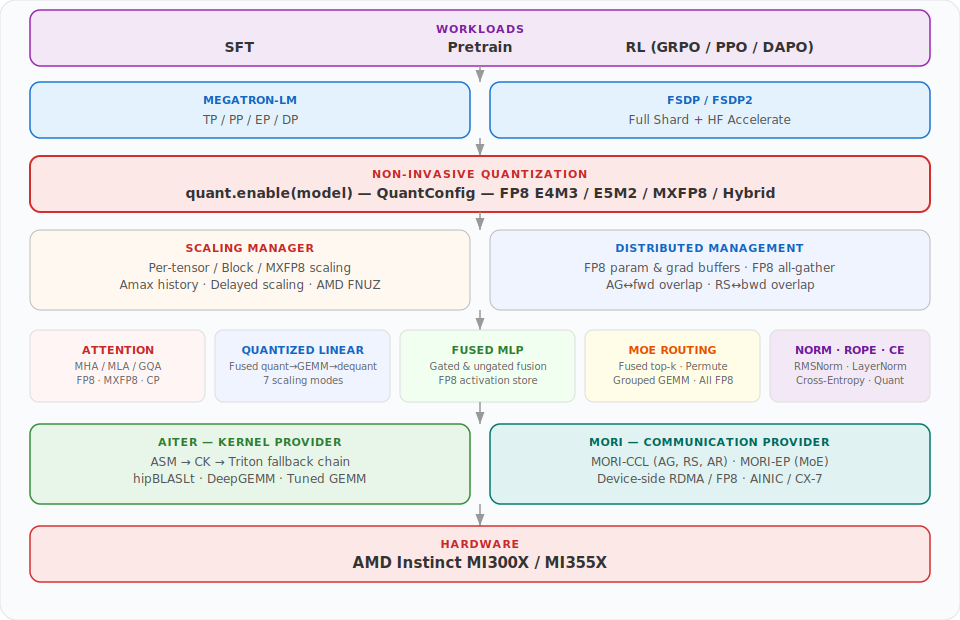

# Lumen

A lightweight, AMD-native quantized training framework for large language models.

Lumen manages the **quantized training lifecycle** — the vertical path a low-precision tensor takes through forward, backward, optimizer, and communication.

- **Quantized Formats** — FP8 (E4M3 / E5M2), MXFP8, and FP4 (Not supported yet) with a unified `QuantConfig` interface
- **[AITER Kernels](https://github.com/ROCm/aiter)** — high-performance GPU kernels for attention, GEMM, normalization, RoPE, MoE, fused MLP, cross-entropy, and quantization
- **[MORI](https://github.com/ROCm/mori)** — high-performance RDMA + GPU communication library for distributed training (MORI-CCL: all-gather, reduce-scatter, all-reduce; MORI-EP: MoE expert dispatch)

## Architecture

Lumen owns the quantized training lifecycle and delegates everything else (optimizer, data loading, distributed orchestration) to the training backend:

<div align="center">
  
</div>

## Quick Start

### Quantized Training (non-invasive patching)

```python
import lumen.quantize as quant
from lumen.quantize import AmaxAlgo, QuantConfig, QuantFormat, ScalingType

# Full config object
config = QuantConfig(
    format=QuantFormat.FP8_E4M3,       # FP8_E5M2, HYBRID, MXFP8
    scaling=ScalingType.DELAYED,        # DYNAMIC, BLOCKWISE
    amax_algo=AmaxAlgo.MAX,             # or MOST_RECENT
    history_len=16,
    quantize_activation=True,           # False → weight-only quantization
    quantize_grad="fp8",                # None, "fp8", "mxfp8", "fp4"
)
quant.enable(model, config=config)

# Or use string shorthand — same effect
quant.enable(model, format="fp8_e4m3", scaling="delayed")

# Training loop is unchanged
output = model(input)       # Lumen handles quantized dispatch
loss.backward()             # Lumen handles quantized gradients
optimizer.step()
```

### FP8 Attention (module API)

See [`lumen/modules/`](lumen/modules/) for the full module API with usage examples.

### Functional API

See [`lumen/ops/`](lumen/ops/) for the stateless functional API with usage examples.

### Training Backends

See [`lumen/models/`](lumen/models/) for Megatron and FSDP stack documentation and usage examples.


### User Install (recommended)

```bash
# All optional dependencies
pip install lumen[all]
```

### Developer Install

```bash
git clone git@github.com:ZhangDanyang-AMD/Lumen.git
cd Lumen

# Editable install with dev dependencies
pip install -e ".[dev]"
```

### Third-party Libraries

| Library | PyPI Package | Purpose |
|---------|-------------|---------|
| [AITER](https://github.com/ROCm/aiter) | `amd-aiter` | AMD-optimised GPU kernels: attention, GEMM, normalization, RoPE, MoE, fused MLP, cross-entropy, quantization (ASM / CK / Triton backends) |
| [MORI](https://github.com/ROCm/mori) | `mori` | Native RDMA + GPU communication: MORI-CCL (collective ops), MORI-EP (MoE dispatch) |


## Examples

| Example | Description | Docs |
|---------|-------------|------|
| **LLaMA2 SFT** | Fine-tuning / LoRA on LLaMA2 7B–70B with FP8 attention, packed sequences, early stopping | [`examples/llama2/`](examples/llama2/) |
| **LLaMA 3.1 Pretrain** | Pretraining LLaMA 3.1 8B with FP8 hybrid training and MXFP8 attention (MLPerf-aligned) | [`examples/llama31/`](examples/llama31/) |

## Testing

See [`tests/`](tests/) for test instructions.

## Project Structure

```
Lumen/
├── lumen/                     # Main Python package
│   ├── core/                  #   FP8 dtype helpers, gradient quantization, device detection
│   ├── kernels/               #   AITER kernel wrappers (FP8/MXFP8 flash attention impl)
│   ├── ops/                   #   Stateless ops API — all backed by AITER
│   │   ├── attention/         #     MHA/MLA/GQA + Context Parallelism (A2A, P2P)
│   │   ├── quantize/          #     Quantized linear, GEMM primitives, quant/dequant ops
│   │   ├── gemm/              #     Grouped GEMM, MoE GEMM dispatch
│   │   ├── normalization/     #     LayerNorm, RMSNorm (ASM, CK, Triton + fused FP8)
│   │   ├── mlp/               #     Fused gated & ungated feed-forward
│   │   ├── moe/               #     Fused routing, sorting, aux loss, fused MoE
│   │   ├── rope.py            #     Fused RoPE (SBHD, THD, 2D, 3D)
│   │   ├── cross_entropy.py   #     Vocab-parallel cross-entropy
│   │   └── dispatch.py        #     ASM → CK → Triton fallback dispatcher
│   ├── modules/               #   nn.Module wrappers (drop-in for Megatron / FSDP)
│   │   ├── attention*.py      #     LumenAttention, LumenDotProductAttention, MLA
│   │   ├── parallel_linear.py #     TP column/row parallel linear + FP8
│   │   ├── grouped_linear.py  #     MoE grouped linear + TP variants
│   │   ├── fused_mlp.py       #     LumenFusedMLP, LumenGatedMLP
│   │   ├── cross_entropy.py   #     Vocab-parallel cross-entropy module
│   │   └── comm_overlap.py    #     AG/GEMM and GEMM/RS overlap
│   ├── quantize/              #   Quantization lifecycle (enable/disable, config, scaling manager)
│   └── models/                #   Training utilities & model definitions
│       ├── megatron.py        #     Shared Megatron stack (spec patching, FP8, LoRA)
│       ├── fsdp.py            #     Shared FSDP stack (FP8, LoRA, state mgmt)
│       ├── llama2/            #     LLaMA2 SFT (dataset, megatron/, fsdp/)
│       └── llama31/           #     LLaMA 3.1 Pretrain (dataset, megatron/, fsdp/)
├── third_party/               # Git submodules
│   ├── aiter/                 #   AMD AITER — GPU kernel provider (ASM, CK, Triton)
│   └── mori/                  #   MORI — RDMA + GPU communication
├── examples/                  # End-to-end training examples (Dockerfile, launcher, scripts)
│   ├── llama2/                #   LLaMA2 SFT
│   └── llama31/               #   LLaMA 3.1 Pretrain
└── tests/                     # Test suite
```

## License

Apache License 2.0
