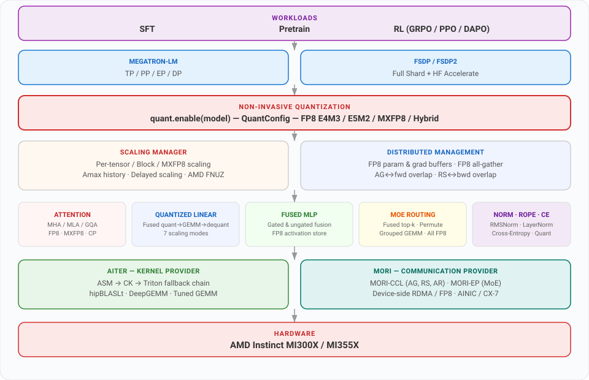

# Lumen

A lightweight, AMD-native quantized training engine for large language models.

Lumen manages the **quantized training lifecycle** — the vertical path a low-precision tensor takes through forward, backward, optimizer, and communication.

- **Quantized Formats** — FP8 (E4M3 / E5M2), MXFP8, and MXFP4 with a unified `QuantConfig` interface
- **[AITER Kernels](https://github.com/ROCm/aiter)** — high-performance GPU kernels for attention, GEMM, normalization, RoPE, MoE, fused MLP, cross-entropy, and quantization
- **[MORI](https://github.com/ROCm/mori)** — high-performance RDMA + GPU communication library for distributed training (MORI-CCL: all-gather, reduce-scatter, all-reduce; MORI-EP: MoE expert dispatch)

## Architecture

Lumen owns the quantized training lifecycle and delegates everything else (optimizer, data loading, distributed orchestration) to the training backend:

<div align="center">
  
</div>

## Quick Start

### Quantized Training (non-invasive patching)

```python
import lumen.quantize as quant
from lumen.quantize import AmaxAlgo, QuantConfig, QuantFormat, ScalingType

# Full config object
config = QuantConfig(
    format=QuantFormat.FP8_E4M3,       # FP8_E5M2, HYBRID, MXFP8
    scaling=ScalingType.DELAYED,        # DYNAMIC, BLOCKWISE
    amax_algo=AmaxAlgo.MAX,             # or MOST_RECENT
    history_len=16,
    quantize_activation=True,           # False → weight-only quantization
    quantize_grad="fp8",                # None, "fp8", "mxfp8", "fp4"
)
quant.enable(model, config=config)

# Or use string shorthand — same effect
quant.enable(model, format="fp8_e4m3", scaling="delayed")

# Training loop is unchanged
output = model(input)       # Lumen handles quantized dispatch
loss.backward()             # Lumen handles quantized gradients
optimizer.step()
```

### Training Backends

See [`lumen/models/`](lumen/models/) for Megatron and FSDP stack documentation and usage examples.


### User Install (recommended)

```bash
# All optional dependencies
pip install lumen[all]
```

### Developer Install

```bash
git clone git@github.com:ZhangDanyang-AMD/Lumen.git
cd Lumen

# Editable install with dev dependencies
pip install -e ".[dev]"
```

### Third-party Libraries

| Library | PyPI Package | Purpose |
|---------|-------------|---------|
| [AITER](https://github.com/ROCm/aiter) | `amd-aiter` | AMD-optimised GPU kernels: attention, GEMM, normalization, RoPE, MoE, fused MLP, cross-entropy, quantization (ASM / CK / Triton backends) |
| [MORI](https://github.com/ROCm/mori) | `mori` | Native RDMA + GPU communication: MORI-CCL (collective ops), MORI-EP (MoE dispatch) |


## Examples

| Example | Description | Docs |
|---------|-------------|------|
| **LLaMA2 SFT** | Full fine-tuning / LoRA on LLaMA2 7B–70B with FP8 attention, packed sequences, early stopping (Megatron + FSDP) | [`examples/llama2/`](examples/llama2/) |
| **LLaMA 3.1 Pretrain** | Pretraining LLaMA 3.1 8B with FP8 hybrid training and MXFP8 attention, MLPerf-aligned (Megatron + FSDP) | [`examples/llama31/`](examples/llama31/) |
| **Qwen3-8B LoRA SFT** | LoRA SFT on Qwen3-8B with PyTorch FSDP + Lumen FP8 blockwise2d quantization on 8×MI308X | [`examples/qwen3/`](examples/qwen3/) |
| **Qwen3-8B MXFP4 Pretrain** | Pretraining Qwen3-8B with MXFP4 quantized training on MI308X | [`examples/qwen3/`](examples/qwen3/) |
| **Qwen3-30B-A3B MoE** | Qwen3-30B-A3B (128 experts) MoE training with FSDP2 + 2D parallelism (DP×EP) on multi-node MI308X | [`examples/qwen3-30b-a3b/`](examples/qwen3-30b-a3b/) |
| **DeepSeek-V4** | DeepSeek-V4 full finetune / pretrain with native torchrun + Lumen + GRPO policy loss on MI308X | [`examples/dsv4/`](examples/dsv4/) |

## LumenRL Integration

Lumen provides the quantized training engine for [LumenRL](https://github.com/ZhangDanyang-AMD/Lumen-RL.git), an AMD-native RL training framework. LumenRL uses Lumen for:

- **Megatron training backend** — FP8/MXFP8 quantized forward and backward through Lumen's Megatron spec patching (`lumen/models/megatron.py`)
- **MoE expert parallelism** — Lumen's grouped linear modules and MoE dispatch for models like Qwen3-30B-A3B (128 experts, EP=8)
- **FP8 KV cache** — Lumen's quantization support for ATOM/vLLM rollout inference with FP8 KV cache
- **HIP C++ extensions** — Fused quant-transpose and FP8 dispatch kernels compiled from `lumen/csrc/`

```bash
# LumenRL depends on Lumen as an editable install
pip install -e /path/to/Lumen
# Then run LumenRL training
pip install -e /path/to/Lumen-RL
```

See the [LumenRL repository](https://github.com/ZhangDanyang-AMD/Lumen-RL.git) for GRPO, GSPO, and agentic RL training examples.

## License

Apache License 2.0
