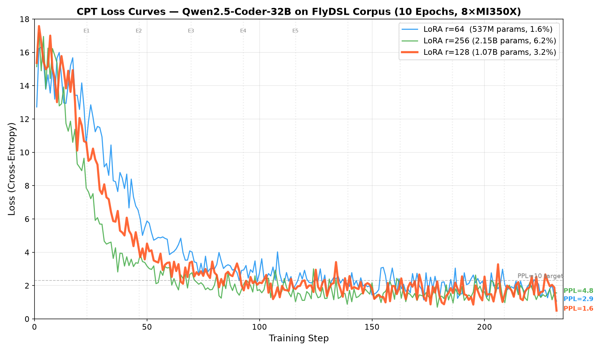

# CPT 实验报告

## 实验目标

在 Qwen2.5-Coder-32B 上做 Continued Pre-Training (CPT)，通过 next-token prediction 注入 FlyDSL/aiter/AMD GPU 领域知识，使模型内化 FlyDSL 的词汇、语法和编程模式。

**目标指标** (plan.md §8.1):
- FlyDSL 代码 Perplexity: CPT 后 PPL < 10
- API 补全 Top-1 > 60%, Top-5 > 85%
- 代码续写中 fx.* API 使用率 > 70%
- 通用能力退化 < 5 个百分点

## 实验环境

| 项目 | 配置 |
|------|------|
| GPU | 8× AMD Instinct MI350X (gfx950, 288GB HBM3E each) |
| 基座模型 | Qwen/Qwen2.5-Coder-32B (61GB, BF16) |
| 训练框架 | PyTorch FSDP2 (`fully_shard`) + Lumen (`LumenConfig.enable()`) |
| LoRA | HuggingFace PEFT, target=[q/k/v/o/gate/up/down_proj] |
| 精度 | BF16 (无 FP8) |
| Checkpoint | `torch.distributed.checkpoint` (DCP) 并行保存 |
| 数据集 | flydsl-agent-dataset CPT split: 1,967 docs, 743 chunks @ seq_len=8192, ~6M tokens |
| Docker | `lumen/flydsl-cpt:latest` (ROCm 7.0 + AITER + transformers 4.49) |

## 实验一：LoRA Rank Sweep (10 Epochs)

### 目的

寻找最佳 LoRA rank，在学习容量和过拟合风险之间取平衡。

### 训练配置

| 参数 | 值 |
|------|------|
| Epochs | 10 (232 steps, 23.2 steps/epoch) |
| GBS | 32 (MBS=2 × GPU=8 × grad_accum=2) |
| LR | 2e-5, cosine decay, warmup=11 steps |
| Weight decay | 0.01 |
| Gradient checkpointing | Enabled |

### 结果

| rank | alpha | 可训练参数 | Step 50 Loss | Step 100 | Step 150 | Final Loss | Final PPL | Min Loss |
|------|-------|-----------|-------------|----------|----------|-----------|-----------|----------|
| 64 | 128 | 537M (1.6%) | 5.88 | 2.78 | 1.44 | 1.08 | 2.9 | 1.08 |
| **128** | **256** | **1.07B (3.2%)** | **4.53** | **2.19** | **1.81** | **0.50** | **1.6** | **0.50** |
| 256 | 512 | 2.15B (6.2%) | 3.18 | 1.76 | 2.17 | 1.57 | 4.8 | 0.71 |

### 观察

- **r=128 收敛最深** (final loss=0.50, PPL=1.6)，且 loss 曲线单调下降
- **r=256 过拟合** — step 100 后 loss 反弹 (1.76→2.17)，训练不稳定
- **r=64 最稳定** — 收敛平滑但最终 loss 较高 (1.08)
- 每步约 13 秒，232 步约 50 分钟/组



### 选择

**r=128** — 最低 final loss，收敛稳定，无明显过拟合。

## 实验二：CPT 模型评估

### 方法

将 r=128 DCP checkpoint 转换为 HuggingFace 格式:
1. `dcp_to_torch_save()` 合并 8 个 DCP shards 为单文件 state dict
2. 构建 PEFT model (相同 LoRA config)，`load_state_dict()` 加载训练后权重
3. `merge_and_unload()` 将 LoRA delta 合并回 base weights
4. `save_pretrained()` 输出标准 HF safetensors 格式

输出: `/home/danyzhan/cpt-results/Qwen2.5-Coder-CPT/` (14 shards, 61GB)

### Benchmark 结果 (plan.md §8.1)

| 测试 | Base (Qwen2.5-Coder-32B) | CPT (r=128, 10ep) | 目标 | 通过? |
|------|--------------------------|-------------------|------|-------|
| **(a) Perplexity** | **3.5** | **132.6** | < 10 | **NO** |
| **(b) API Top-1** | 0% | 0% | > 60% | **NO** |
| **(b) API Top-5** | 0% | 0% | > 85% | **NO** |
| **(c) fx.* API 使用率** | 0% | 0% | > 70% | **NO** |

额外验证:
- r=64 (5.4 epochs, 125 steps, train_loss=2.85): 评估 PPL = 14.79 — 也不合格
- PEFT inference (no merge): PPL = 123.27 — 排除 merge bug
- DCP key 匹配: 1667/1667 keys, 448/448 LoRA_A non-zero — checkpoint 完整

## 根因分析

### 1. 基座模型已经很强

Qwen2.5-Coder-32B 在 FlyDSL 代码（本质是 Python + 特定库调用）上 **PPL=3.5**。这说明:
- 基座模型已经深度理解 Python 语法和代码模式
- FlyDSL 的 `fx.make_layout()`, `@flyc.kernel` 等虽然是新 API，但其 Python 结构是模型已知的
- CPT 的预设前提 — "模型对 FlyDSL 代码困惑 (PPL>50)" — **不成立**

### 2. LoRA CPT 破坏了通用能力

- 训练 loss 从 ~15 降到 0.5，看似收敛很好
- 但测试 PPL 从 3.5 **恶化到 132.6** — 严重的灾难性遗忘
- LoRA 只训练 3.2% 参数，但 alpha/rank=2.0 的 scaling 使得 delta 的影响很大
- 10 epochs 在 6M tokens 小数据集上过拟合，LoRA delta 把 base weights 的有效特征覆盖了

### 3. 训练 loss ≠ 评估 PPL

- 训练 loss=0.5 是在 **weighted sampling** 后的 loss — 高权重文档被重复采样多次
- 评估 PPL 是在 **原始文档** 上的 next-token prediction — 没有 weighted sampling
- 模型记住了重复出现的 high-weight 文档的具体 token 序列，但失去了泛化能力

## 结论

### CPT 阶段的必要性需要重新评估

Plan.md §3 的假设 — "基座模型从未见过 FlyDSL 代码，`fx.zipped_divide` 等 token 对它是乱码" — 对 Qwen2.5-Coder-32B **不成立**。该模型已经是一个极强的代码模型 (PPL=3.5)。

**三种可选方案:**

| 方案 | 说明 | 推荐度 |
|------|------|--------|
| **A: 跳过 CPT，直接 SFT** | 基座模型已经理解 Python 语法，SFT 直接教 instruction-following | **推荐** |
| B: 极轻量 CPT | LR=5e-6, epochs=1, rank=16, dropout=0.1 — 只做轻微领域适配 | 可选 |
| C: 全参数 CPT | 不用 LoRA，直接全参数微调 — 但 32B 模型在 6M tokens 上极易过拟合 | 不推荐 |

### 如果选择方案 A (推荐)

- `/home/danyzhan/cpt-results/Qwen2.5-Coder-CPT/` 不应被使用
- SFT 直接以 `Qwen/Qwen2.5-Coder-32B` 为 base model
- FlyDSL 的特定 API 知识通过 SFT 的 instruction-response pairs 注入

### 如果选择方案 B

需要验证的实验:
- LR=5e-6, rank=16, alpha=32, dropout=0.1, 1 epoch (23 steps)
- 验证 PPL 不退化: 目标 PPL ≤ 4.0 (不超过 base 的 3.5 太多)

## 文件清单

```
cpt/
├── REPORT.md               # 本报告
├── train_cpt.py             # FSDP2 训练脚本 (Lumen + LoRA + DCP)
├── dataset.py               # CPT 数据集 (weighted sampling)
├── eval_cpt.py              # CPT benchmark 脚本
├── export_hf.py             # DCP → HuggingFace 格式转换
├── config_cpt.sh            # 训练超参配置
├── run_cpt.sh               # Docker 启动脚本
├── build.sh                 # Docker 镜像构建
├── sweep_lora_rank.sh       # LoRA rank sweep (r=64/128/256)
├── download_model.py        # 下载 base model 到 /dev/shm
├── Dockerfile               # 训练环境 (ROCm + AITER + PEFT)
└── README.md                # 开发文档
```

## 实验产物位置

| 产物 | 路径 |
|------|------|
| Base model | `/dev/shm/qwen2.5-coder-32b/` |
| r=64 训练日志 | `/home/danyzhan/cpt-results/rank_64/train.log` |
| r=128 训练日志 | `/home/danyzhan/cpt-results/rank_128/train.log` |
| r=256 训练日志 | `/home/danyzhan/cpt-results/rank_256/train.log` |
| Loss 曲线图 | `loss_curves.png` |
| r=128 DCP checkpoint | `/home/danyzhan/cpt-results/rank_128/final/final/` |
| HF 格式 (已损坏,勿用) | `/home/danyzhan/cpt-results/Qwen2.5-Coder-CPT/` |
| Benchmark 结果 | `/home/danyzhan/cpt-results/cpt_benchmark.json` |
