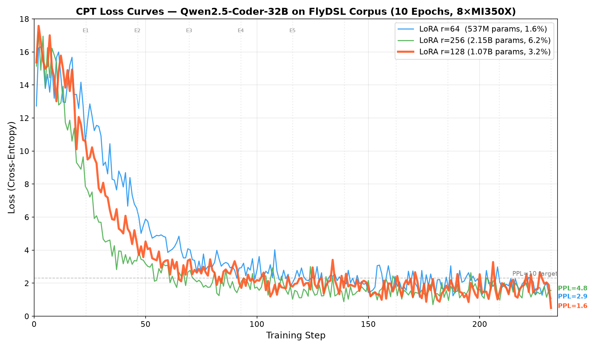

# CPT Experiment Report

## Experiment Objective

Perform Continued Pre-Training (CPT) on Qwen2.5-Coder-32B via next-token prediction to inject FlyDSL/aiter/AMD GPU domain knowledge, so the model internalizes FlyDSL vocabulary, syntax, and programming patterns.

**Target metrics** (plan.md §8.1):
- FlyDSL code Perplexity: CPT PPL < 10
- API completion Top-1 > 60%, Top-5 > 85%
- fx.* API usage rate in code continuation > 70%
- General capability degradation < 5 percentage points

## Experiment Environment

| Item | Configuration |
|------|------|
| GPU | 8× AMD Instinct MI350X (gfx950, 288GB HBM3E each) |
| Base model | Qwen/Qwen2.5-Coder-32B (61GB, BF16) |
| Training framework | PyTorch FSDP2 (`fully_shard`) + Lumen (`LumenConfig.enable()`) |
| LoRA | HuggingFace PEFT, target=[q/k/v/o/gate/up/down_proj] |
| Precision | BF16 (no FP8) |
| Checkpoint | `torch.distributed.checkpoint` (DCP) parallel save |
| Dataset | flydsl-agent-dataset CPT split: 1,967 docs, 743 chunks @ seq_len=8192, ~6M tokens |
| Docker | `lumen/flydsl-cpt:latest` (ROCm 7.0 + AITER + transformers 4.49) |

## Experiment 1: LoRA Rank Sweep (10 Epochs)

### Purpose

Find the optimal LoRA rank, balancing learning capacity and overfitting risk.

### Training Configuration

| Parameter | Value |
|------|------|
| Epochs | 10 (232 steps, 23.2 steps/epoch) |
| GBS | 32 (MBS=2 × GPU=8 × grad_accum=2) |
| LR | 2e-5, cosine decay, warmup=11 steps |
| Weight decay | 0.01 |
| Gradient checkpointing | Enabled |

### Results

| rank | alpha | Trainable params | Step 50 Loss | Step 100 | Step 150 | Final Loss | Final PPL | Min Loss |
|------|-------|-----------|-------------|----------|----------|-----------|-----------|----------|
| 64 | 128 | 537M (1.6%) | 5.88 | 2.78 | 1.44 | 1.08 | 2.9 | 1.08 |
| **128** | **256** | **1.07B (3.2%)** | **4.53** | **2.19** | **1.81** | **0.50** | **1.6** | **0.50** |
| 256 | 512 | 2.15B (6.2%) | 3.18 | 1.76 | 2.17 | 1.57 | 4.8 | 0.71 |

### Observations

- **r=128 converges deepest** (final loss=0.50, PPL=1.6), with a monotonically decreasing loss curve
- **r=256 overfits** — loss rebounds after step 100 (1.76→2.17), unstable training
- **r=64 most stable** — smooth convergence but higher final loss (1.08)
- ~13 seconds per step, ~50 minutes per run for 232 steps



### Selection

**r=128** — lowest final loss, stable convergence, no obvious overfitting.

## Experiment 2: CPT Model Evaluation

### Method

Convert r=128 DCP checkpoint to HuggingFace format:
1. `dcp_to_torch_save()` merges 8 DCP shards into a single state dict file
2. Build PEFT model (same LoRA config), `load_state_dict()` loads trained weights
3. `merge_and_unload()` merges LoRA delta back into base weights
4. `save_pretrained()` outputs standard HF safetensors format

Output: `/home/danyzhan/cpt-results/Qwen2.5-Coder-CPT/` (14 shards, 61GB)

### Benchmark Results (plan.md §8.1)

| Test | Base (Qwen2.5-Coder-32B) | CPT (r=128, 10ep) | Target | Pass? |
|------|--------------------------|-------------------|------|-------|
| **(a) Perplexity** | **3.5** | **132.6** | < 10 | **NO** |
| **(b) API Top-1** | 0% | 0% | > 60% | **NO** |
| **(b) API Top-5** | 0% | 0% | > 85% | **NO** |
| **(c) fx.* API usage rate** | 0% | 0% | > 70% | **NO** |

Additional validation:
- r=64 (5.4 epochs, 125 steps, train_loss=2.85): eval PPL = 14.79 — also failed
- PEFT inference (no merge): PPL = 123.27 — rules out merge bug
- DCP key match: 1667/1667 keys, 448/448 LoRA_A non-zero — checkpoint intact

## Root Cause Analysis

### 1. Base Model Is Already Strong

Qwen2.5-Coder-32B has **PPL=3.5** on FlyDSL code (essentially Python + specific library calls). This indicates:
- The base model already deeply understands Python syntax and code patterns
- FlyDSL APIs like `fx.make_layout()`, `@flyc.kernel` are new, but their Python structure is already known to the model
- CPT's premise — "model is confused by FlyDSL code (PPL>50)" — **does not hold**

### 2. LoRA CPT Destroyed General Capability

- Training loss dropped from ~15 to 0.5, appearing to converge well
- But test PPL worsened from 3.5 **to 132.6** — severe catastrophic forgetting
- LoRA trains only 3.2% of parameters, but alpha/rank=2.0 scaling makes the delta impact large
- 10 epochs on a 6M-token small dataset overfit; LoRA delta overwrote effective base weight features

### 3. Training Loss ≠ Evaluation PPL

- Training loss=0.5 is on **weighted sampling** loss — high-weight documents are resampled multiple times
- Evaluation PPL is next-token prediction on **original documents** — no weighted sampling
- Model memorized repeated high-weight document token sequences but lost generalization

## Conclusion

### CPT Phase Necessity Needs Re-evaluation

Plan.md §3 assumption — "base model has never seen FlyDSL code, tokens like `fx.zipped_divide` are gibberish" — **does not hold** for Qwen2.5-Coder-32B. It is already an extremely strong code model (PPL=3.5).

**Three options:**

| Option | Description | Recommendation |
|------|------|--------|
| **A: Skip CPT, SFT directly** | Base model already understands Python syntax; SFT teaches instruction-following directly | **Recommended** |
| B: Ultra-light CPT | LR=5e-6, epochs=1, rank=16, dropout=0.1 — light domain adaptation only | Optional |
| C: Full-parameter CPT | No LoRA, full fine-tuning — but 32B model easily overfits on 6M tokens | Not recommended |

### If Choosing Option A (Recommended)

- `/home/danyzhan/cpt-results/Qwen2.5-Coder-CPT/` should not be used
- SFT uses `Qwen/Qwen2.5-Coder-32B` as base model directly
- FlyDSL-specific API knowledge is injected via SFT instruction-response pairs

### If Choosing Option B

Experiments to validate:
- LR=5e-6, rank=16, alpha=32, dropout=0.1, 1 epoch (23 steps)
- Verify PPL does not degrade: target PPL ≤ 4.0 (not much worse than base 3.5)

## File Inventory

```
cpt/
├── REPORT.md               # This report
├── train_cpt.py             # FSDP2 training script (Lumen + LoRA + DCP)
├── dataset.py               # CPT dataset (weighted sampling)
├── eval_cpt.py              # CPT benchmark script
├── export_hf.py             # DCP → HuggingFace format conversion
├── config_cpt.sh            # Training hyperparameter config
├── run_cpt.sh               # Docker launch script
├── build.sh                 # Docker image build
├── sweep_lora_rank.sh       # LoRA rank sweep (r=64/128/256)
├── download_model.py        # Download base model to /dev/shm
├── Dockerfile               # Training environment (ROCm + AITER + PEFT)
└── README.md                # Development documentation
```

## Experiment Artifact Locations

| Artifact | Path |
|------|------|
| Base model | `/dev/shm/qwen2.5-coder-32b/` |
| r=64 training log | `/home/danyzhan/cpt-results/rank_64/train.log` |
| r=128 training log | `/home/danyzhan/cpt-results/rank_128/train.log` |
| r=256 training log | `/home/danyzhan/cpt-results/rank_256/train.log` |
| Loss curve plot | `loss_curves.png` |
| r=128 DCP checkpoint | `/home/danyzhan/cpt-results/rank_128/final/final/` |
| HF format (corrupted, do not use) | `/home/danyzhan/cpt-results/Qwen2.5-Coder-CPT/` |
| Benchmark results | `/home/danyzhan/cpt-results/cpt_benchmark.json` |
