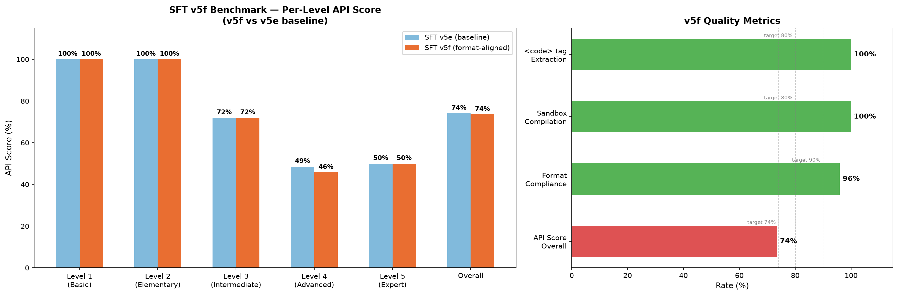
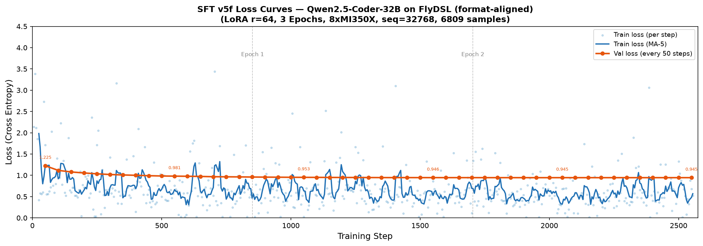

# SFT v5f: Format-Aligned Training

Train Qwen2.5-Coder-32B to output `<plan>+<code>` dual-segment format for HRD (Hierarchical Reward Decomposition), while preserving v5e's FlyDSL code generation ability.

## Results

| Metric | v5f | v5e Baseline | Target |
|--------|-----|-------------|--------|
| API Score | **74%** | 74% | >= 74% |
| Format Compliance | **96%** | -- | >= 90% |
| Sandbox Compilation | **100%** | -- | >= 80% |




See [RESULTS.md](RESULTS.md) for per-prompt detail and v1 comparison.

## Data Strategy

Keep ALL v5e data verbatim (3889 samples) and ADD dual-segment copies of kernel samples (~1870) plus reasoning samples (~1050). The model learns both output modes:

- Original system prompt -> raw kernel code (preserves v5e ability)
- Format system prompt + "explain decisions" -> `<plan>+<code>` (learns dual-segment)

| Category | Count | Format |
|----------|-------|--------|
| v5e verbatim (all) | 3889 | original |
| Kernel dual-segment copies | ~1870 | `<plan>+<code>` |
| Cat2 general reasoning | ~700 | `<plan>+<code>` |
| Cat3 complex CoT | ~350 | `<plan>+<code>` |
| **Total** | **6809** | mixed |

## Prerequisites

- 8x AMD MI350X GPUs
- Docker image: `lumen/flydsl-cpt:latest`
- Base model: `Qwen/Qwen2.5-Coder-32B` at `/dev/shm/qwen2.5-coder-32b`
- v5e SFT data: `/home/danyzhan/flydsl-agent-dataset/data/sft/`
- Anthropic API key (for data generation)

## Pipeline

### Step 1: Generate v5f data

Reads v5e SFT data, uses Claude API to reverse-annotate kernel samples with `<plan>` segments, adds cat2/cat3 reasoning samples.

```bash
export ANTHROPIC_API_KEY=sk-ant-...
python generate_v5f_data.py \
    --sft-data /home/danyzhan/flydsl-agent-dataset/data/sft/train-00000-of-00001.jsonl \
    --val-data /home/danyzhan/flydsl-agent-dataset/data/sft/validation-00000-of-00001.jsonl \
    --output /home/danyzhan/flydsl-agent-dataset/data/format_aligned/train.jsonl \
    --val-output /home/danyzhan/flydsl-agent-dataset/data/format_aligned/validation.jsonl
```

Key options:
- `--max-kernel 1879`: max kernel samples to annotate (default: all)
- `--max-kernel-chars 120000`: truncate kernels longer than this (for SEQ_LEN=32768)
- `--max-cat2 700` / `--max-cat3 350`: reasoning sample counts
- `--concurrency 10`: parallel API calls

Plan-code consistency: `_extract_code_decisions()` statically parses tile sizes, pipeline stages, swizzle patterns, MFMA, etc. from kernel code, then validates the plan references these actual decisions (90% coverage). Inconsistent samples are discarded.

### Step 2: Train

Uses same hyperparams as v5e (LoRA r=64, 3 epochs, lr 1e-5) but from base model, not from v5e.

```bash
bash run_v5f.sh
```

Training config (`config_v5f.sh`):
- LoRA: r=64, alpha=128, dropout=0.1
- LR: 1e-5 (cosine decay)
- SEQ_LEN: 32768
- Epochs: 3 (steps computed automatically from data size)
- GBS: 8 (1 x 1 x 8 GPUs)

Estimated time: ~10h on 8xMI350X for ~6800 samples.

### Step 3: Export to HuggingFace format

Converts DCP checkpoint to HF safetensors with LoRA merged.

```bash
bash export_v5f.sh
```

Output: `/home/danyzhan/sft-results/Qwen2.5-Coder-SFT-v5f`

### Step 4: Evaluate

Runs three evaluations against v5e baseline:
- Part A: API Score (25 prompts, 5 difficulty levels)
- Part B: Format compliance (`<plan>+<code>` presence)
- Part C: Sandbox compilation (Python syntax + FlyDSL imports + `<code>` tag extraction)

```bash
bash eval_v5f.sh
```

Output: `/home/danyzhan/sft-results/benchmark_v5f.json` + `/home/danyzhan/sft-results/eval_v5f.log`

### Step 5: Generate charts

```bash
python generate_v5f_charts.py
```

Output: `sft_benchmark.png`, `sft_loss_curves.png`

## File Reference

```
sft-format-aligned/
├── generate_v5f_data.py       # Data construction (Claude API)
├── config_v5f.sh              # Training hyperparameters
├── run_v5f.sh                 # Docker training launcher
├── export_v5f.sh              # DCP -> HF model export
├── eval_format_aligned.py     # Evaluation logic (shared by eval_v5f.sh)
├── eval_v5f.sh                # Evaluation launcher
├── generate_v5f_charts.py     # Chart generation
├── RESULTS.md                 # Detailed results and analysis
├── sft_benchmark.png          # Benchmark comparison chart
├── sft_loss_curves.png        # Training loss curves
├── results/                   # Raw logs and JSON results
│   ├── benchmark_v5f.json
│   ├── eval_v5f.log
│   └── v5f_run.log
└── archived_v1/               # v1 (patch-on-v5e) scripts, kept for reference
```

## Model

- Local: `/home/danyzhan/sft-results/Qwen2.5-Coder-SFT-v5f`
- HuggingFace: [Zhangdanyang/Qwen2.5-Coder-SFT-v5f](https://huggingface.co/Zhangdanyang/Qwen2.5-Coder-SFT-v5f)
