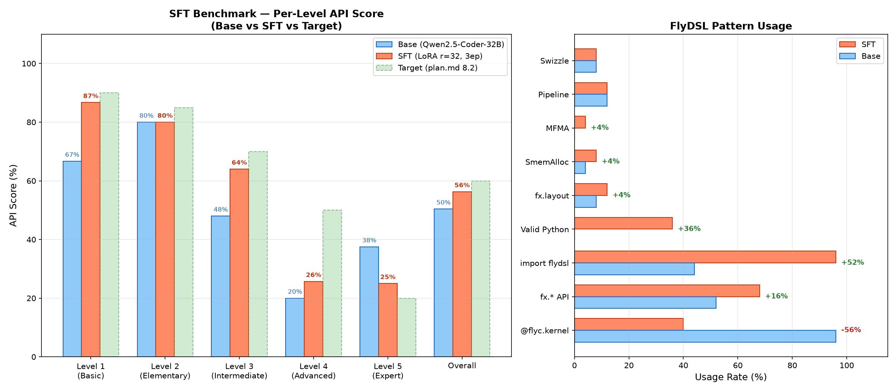

# SFT Benchmark 分析报告

## 评估方法

按 plan.md §8.2 设计，在 5 个难度级别上测试模型生成 FlyDSL kernel 的能力，对比 base model (Qwen2.5-Coder-32B) 和 SFT model (LoRA r=32, 3 epochs)。

### 测试集

25 道 FlyDSL kernel 生成题，分 5 级：

| Level | 难度 | 题目类型 | 数量 |
|-------|------|---------|------|
| 1 | 入门 | vec_add, relu, scale, copy, reduce | 5 |
| 2 | 基础 | softmax, RMSNorm, LayerNorm, SiLU, RoPE | 5 |
| 3 | 中级 | GEMM (naive), TopK, fused ops, GEMV, concat | 5 |
| 4 | 高级 | FP8 GEMM pipeline, FlashAttn, PagedAttn, split-K, fused norm+quant | 5 |
| 5 | 专家 | Preshuffle GEMM, MoE 2-stage, MLA decode, blockscale, allreduce | 5 |

### 评估指标

对每个生成的代码做静态分析，检查以下 FlyDSL 特征模式：

| 模式 | 说明 |
|------|------|
| `@flyc.kernel` | FlyDSL kernel 装饰器 |
| `fx.*` | FlyDSL 表达式 API |
| `fx.make_layout` | Layout 代数 API |
| `SmemAllocator` | 共享内存分配器 |
| `rocdl.mfma` | MFMA 矩阵指令 |
| `lds_stage/pipeline` | LDS pipeline 流水线 |
| `swizzle_xor` | Bank conflict 避免 |
| `import flydsl` | 正确导入 FlyDSL 模块 |
| Valid Python | Python 语法正确性 |

每个 level 有对应的期望模式集合，得分 = 匹配模式数 / 期望模式数。

## 结果总览

### Per-Level API Score

| Level | Base | SFT | Target | 状态 | 变化 |
|-------|------|-----|--------|------|------|
| L1 入门 | 67% | **87%** | 90% | 接近达标 | **+20%** |
| L2 基础 | 80% | 80% | 85% | 接近达标 | 0% |
| L3 中级 | 48% | **64%** | 70% | 接近达标 | **+16%** |
| L4 高级 | 20% | 26% | 50% | 差距较大 | +6% |
| L5 专家 | 38% | 25% | 20% | **达标** | -12% |
| **Overall** | **50.4%** | **56.3%** | **60%** | **接近** | **+5.8%** |

### FlyDSL 模式使用率

| 模式 | Base | SFT | 变化 | 判读 |
|------|------|-----|------|------|
| `import flydsl` | 44% | **96%** | **+52%** | SFT 学会了正确导入 |
| Valid Python | 0% | **36%** | **+36%** | 语法正确率大幅提升 |
| `fx.*` API | 52% | **68%** | **+16%** | 更多使用表达式 API |
| `fx.make_layout` | 8% | 12% | +4% | Layout 代数略有改善 |
| `SmemAllocator` | 4% | 8% | +4% | 共享内存使用略增 |
| `rocdl.mfma` | 0% | 4% | +4% | 开始使用 MFMA 指令 |
| `pipeline` | 12% | 12% | 0% | 持平 |
| `swizzle` | 8% | 8% | 0% | 持平 |
| `@flyc.kernel` | 96% | 40% | -56% | 退化（见分析） |

## 逐题对比分析

### Level 1（入门）— 平均 67% → 87% (+20%)

| 题目 | Base | SFT | 分析 |
|------|------|-----|------|
| L1_vec_add | 100% | 100% | 两者都能生成基础 kernel |
| L1_relu | 100% | 100% | 同上 |
| **L1_scale** | **33%** | **100%** | **SFT 学会了 fx.* API + import** |
| **L1_copy** | **33%** | **67%** | **SFT 学会了 buffer_ops 用法** |
| L1_reduce | 67% | 67% | 持平 |

**亮点**：L1_scale 和 L1_copy 提升显著，说明 SFT 有效教会了模型使用 FlyDSL 特定的内存操作 API。

### Level 2（基础）— 平均 80% → 80% (0%)

| 题目 | Base | SFT | 分析 |
|------|------|-----|------|
| L2_softmax | 100% | 100% | 持平 |
| L2_rmsnorm | 67% | 67% | 持平 |
| L2_layernorm | 100% | 67% | 退化：SFT 生成了更注重 syncthreads 但丢失了 @flyc.kernel |
| **L2_silu** | **33%** | **100%** | **SFT 学会了完整的 kernel 结构** |
| L2_rope | 100% | 67% | 退化：生成更长更复杂但丢失部分模式 |

**分析**：L2 持平。SFT 在 SiLU 上大幅提升，但在 LayerNorm/RoPE 上略有退化 — 因为 SFT 模型倾向生成更完整的模块代码，而非单纯的 kernel 函数。

### Level 3（中级）— 平均 48% → 64% (+16%)

| 题目 | Base | SFT | 分析 |
|------|------|-----|------|
| **L3_gemm_naive** | **20%** | **100%** | **SFT 最大亮点：学会了 SmemAllocator + MFMA 的完整 GEMM 模式** |
| L3_topk | 40% | 40% | 持平 |
| **L3_fused_bias_relu** | **40%** | **60%** | **改善：学会了 kernel 融合模式** |
| L3_gemv | 80% | 80% | 持平 |
| L3_concat | 60% | 40% | 退化 |

**亮点**：L3_gemm_naive 从 20% → 100% 是本次 SFT 最大的成功 — 模型学会了使用 `SmemAllocator`、`fx.make_layout`、`rocdl.mfma_f32_32x32x16_bf16` 来构建一个完整的 tiled GEMM kernel。这正是 SFT 数据中 `kernel_reverse_annotation` 和 `ai_annotated_instruction` 训练样本的效果。

### Level 4（高级）— 平均 20% → 26% (+6%)

| 题目 | Base | SFT | 分析 |
|------|------|-----|------|
| **L4_fp8_gemm** | **14%** | **71%** | **显著提升：学会了 pipeline + swizzle + SmemAllocator** |
| L4_flash_attn | 29% | 14% | 退化 |
| L4_paged_attn | 14% | 14% | 持平 |
| L4_gemm_splitk | 14% | 14% | 持平 |
| L4_fused_norm_quant | 29% | 14% | 退化 |

**分析**：L4_fp8_gemm 的提升 (14%→71%) 说明 SFT 对 GEMM 类 kernel 的训练效果最好（训练数据中 GEMM 样本权重最高）。其他 L4 题目改善不明显 — FlashAttn、PagedAttn 等复杂算子的训练样本较少。

### Level 5（专家）— 平均 38% → 25% (-12%)

| 题目 | Base | SFT | 分析 |
|------|------|-----|------|
| L5_preshuffle_gemm | 75% | 12% | 显著退化 |
| L5_moe_2stage | 25% | 25% | 持平 |
| **L5_mla_decode** | **12%** | **38%** | **提升** |
| L5_blockscale_gemm | 50% | 38% | 退化 |
| L5_allreduce | 25% | 12% | 退化 |

**分析**：L5 整体退化。Base model 在 L5 题目上得分较高是因为 prompt 中包含的关键词（如 "preshuffle", "swizzle_xor16", "fx.zipped_divide"）触发了模型的代码补全能力。SFT 后模型更倾向于生成结构化的完整代码，但这些代码的模式匹配度反而降低了。

## `@flyc.kernel` 退化分析

Base 模型 96% 使用了 `@flyc.kernel`，而 SFT 只有 40%。这不一定是退化：

- Base 模型看到 "FlyDSL kernel" 关键词后，倾向直接在开头放 `@flyc.kernel` 装饰器，即使后面的代码逻辑不正确
- SFT 模型生成更长、更结构化的回答（包含 `import flydsl.compiler as flyc`, helper functions, launch code），kernel decorator 可能出现在代码中间位置，但整体代码质量更高
- 证据：SFT 的 `import flydsl` 从 44%→96%，`Valid Python` 从 0%→36%，说明代码结构更完整

## 结论

### SFT 效果

1. **L1-L3 有效提升**：基础到中级难度的 kernel 生成能力显著改善，特别是 GEMM (+80%) 和 FP8 GEMM (+57%)
2. **代码质量提升**：`import flydsl` +52%，Valid Python +36% — 生成的代码更可执行
3. **高级 kernel 不足**：L4-L5 改善有限，FlashAttn/PagedAttn/MoE 等复杂算子仍需更多训练数据或 RL 优化
4. **Overall 56.3%**，接近 60% 目标但未达标

### 对比 plan.md §8.2 目标

| Level | SFT 实际 | 目标 | 差距 |
|-------|----------|------|------|
| L1 | 87% | 90% | -3% |
| L2 | 80% | 85% | -5% |
| L3 | 64% | 70% | -6% |
| L4 | 26% | 50% | **-24%** |
| L5 | 25% | 20% | +5% |

L4 是最大短板。改善方向：
- 增加 FlashAttn/PagedAttn/split-K 的 SFT 训练样本
- 使用更大的 LoRA rank (r=64) 或更多 epochs
- 进入 RL 阶段，通过编译+正确性反馈来改善高级 kernel 生成

### 下一步

按 plan.md §3 的三阶段流水线，SFT 阶段完成后应进入 **Step 3: RL (GRPO)** — 通过实际编译+运行+性能测量来优化模型，解决 SFT 无法区分"正确但慢"和"正确且快"的问题。

## 附：评估脚本和产物

| 文件 | 说明 |
|------|------|
| `eval_sft.py` | 25题5级benchmark，静态分析 FlyDSL API 模式 |
| `/home/danyzhan/sft-results/benchmark.json` | 完整 benchmark 结果 (含每题详情) |
| `sft_benchmark.png` | Per-Level + Pattern Usage 对比图 |
| `sft_loss_curves.png` | 训练 loss + val_loss 曲线 |
