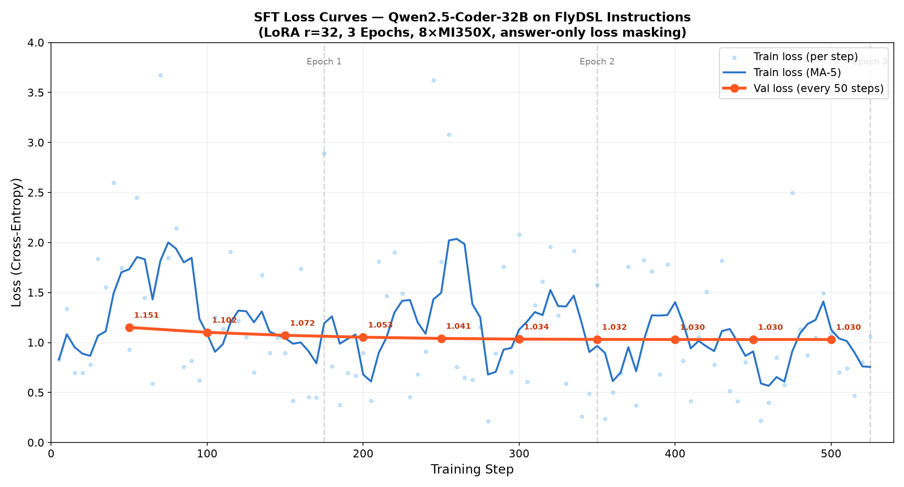

# SFT 训练过程记录

## 训练决策

基于 CPT 阶段的实验结论（见 `../cpt/REPORT.md`），Qwen2.5-Coder-32B 在 FlyDSL 代码上的 base PPL 已经很低 (3.5)，CPT 反而导致灾难性遗忘。因此 **跳过 CPT，直接在 base model 上做 SFT**。

## 环境

| 项目 | 配置 |
|------|------|
| GPU | 8× AMD Instinct MI350X (gfx950) |
| Base model | Qwen/Qwen2.5-Coder-32B (61GB, BF16) |
| 框架 | PyTorch FSDP2 (`fully_shard`) + Lumen (`LumenConfig.enable()`) |
| LoRA | HuggingFace PEFT, r=32, alpha=64, dropout=0.1 |
| Checkpoint | `torch.distributed.checkpoint` (DCP) |
| Docker | `lumen/flydsl-cpt:latest` (复用 CPT 镜像) |

## 数据集

| Split | 样本数 | 格式 |
|-------|--------|------|
| Train | 2,808 | ChatML (`system` + `user` + `assistant`) |
| Validation | 264 | 同上 |

SFT 数据来源分布：

| 来源 | 数量 | 说明 |
|------|------|------|
| augmentation_hardware | 766 | 硬件适配 (gfx942↔gfx950↔gfx1250) |
| documentation_qa | 669 | 文档问答 |
| kernel_reverse_annotation | 388 | 代码→指令反标注 (3种风格) |
| ai_annotated_instruction | 375 | 5模型共识标注 |
| refusal_boundary | 135 | 拒绝边界训练 |
| augmentation_tile | 105 | Tile配置变体 |
| test_parameterization | 89 | 测试参数化 |
| git_history | 88 | Git commit分析 |
| augmentation_pipeline | 73 | Pipeline深度变体 |
| 其他 | 120 | 性能改进、技能QA等 |

## 训练配置

| 参数 | 值 | 来源 |
|------|------|------|
| Max steps | 527 | 2808 / GBS=16 × 3 epochs |
| GBS | 16 | MBS=1 × GPU=8 × grad_accum=2 |
| Sequence length | 8192 | |
| LR | 1e-5 | plan.md §7.3 |
| LR schedule | Cosine, warmup=26 steps (5%) | |
| Weight decay | 0.01 | |
| LoRA rank | 32 | plan.md §3 (SFT任务更聚焦) |
| LoRA alpha | 64 | alpha = 2 × rank |
| LoRA dropout | 0.1 | 小数据集正则化 |
| LoRA targets | q/k/v/o/gate/up/down_proj | 全部attention+MLP |
| Loss masking | answer-only | 仅assistant token参与loss |
| Eval interval | 50 steps | |

可训练参数：268,435,456 / 33,032,311,808 (0.81%)

## Smoke Test

5步测试验证通过：
- 2808 train + 264 val 全部加载 (0 skipped)
- step 5 loss=0.83 — 合理范围
- DCP checkpoint 保存成功

## 训练过程

### Loss 曲线



训练耗时约 57 分钟 (07:46 ~ 08:44)，每步约 6.5 秒。

**Train loss** 特征：
- 波动很大 (min=0.21, max=3.67, std=0.77)
- 原因：SFT 数据多样性高 (13种来源)，简单文档QA loss~0.2，复杂kernel代码 loss~3.6
- 整体趋势下降：前半均值 1.32 → 后半均值 1.22

**Validation loss** 走势：

| Step | Val Loss | 阶段 |
|------|----------|------|
| 50 | 1.1512 | 快速下降 |
| 100 | 1.1018 | |
| 150 | 1.0721 | |
| 200 | 1.0532 | |
| 250 | 1.0411 | 收敛中 |
| 300 | 1.0344 | |
| 350 | 1.0315 | 接近平台 |
| **400** | **1.0302** | **最低点** |
| 450 | 1.0303 | 持平 |
| 500 | 1.0304 | 微升 → 过拟合临界 |

### 收敛分析

Val loss 改善率逐步递减：

| 区间 | Δ Val Loss | 改善率 |
|------|-----------|--------|
| 50→100 | -0.0494 | 4.3% |
| 100→150 | -0.0297 | 2.7% |
| 150→200 | -0.0189 | 1.8% |
| 200→250 | -0.0121 | 1.1% |
| 250→300 | -0.0067 | 0.6% |
| 300→350 | -0.0029 | 0.3% |
| 350→400 | -0.0013 | 0.1% |
| 400→450 | +0.0001 | -0.01% |
| 450→500 | +0.0001 | -0.01% |

**结论：3 epochs 是最优选择。** Val loss 在 epoch 2~3 间完全平台化 (1.030)，step 450 后开始微升，再多训练只会过拟合。

## 模型导出

DCP checkpoint → HuggingFace 格式：

```
dcp_to_torch_save() → load_state_dict() → merge_and_unload() → save_pretrained()
```

- 输入：`/home/danyzhan/sft-results/final/final/` (DCP, 8 shards)
- 输出：`/home/danyzhan/sft-results/Qwen2.5-Coder-SFT/` (14 safetensors, 61GB)
- Key 匹配：1667/1667，LoRA_A non-zero：224/224

## 文件清单

```
sft/
├── TRAINING.md          # 本文档
├── REPORT.md            # Benchmark 分析报告
├── train_sft.py         # FSDP2 SFT 训练脚本
├── dataset.py           # ChatML 数据集 + answer-only loss mask
├── eval_sft.py          # 5级难度 benchmark 脚本
├── config_sft.sh        # 训练超参配置
└── run_sft.sh           # Docker 启动脚本
```

## 产物位置

| 产物 | 路径 |
|------|------|
| 训练日志 | `/home/danyzhan/sft-results/train.log` |
| Loss 曲线图 | `sft_loss_curves.png` |
| DCP checkpoint | `/home/danyzhan/sft-results/final/final/` |
| HF 模型 | `/home/danyzhan/sft-results/Qwen2.5-Coder-SFT/` |
| Benchmark 图 | `sft_benchmark.png` |
| Benchmark JSON | `/home/danyzhan/sft-results/benchmark.json` |
