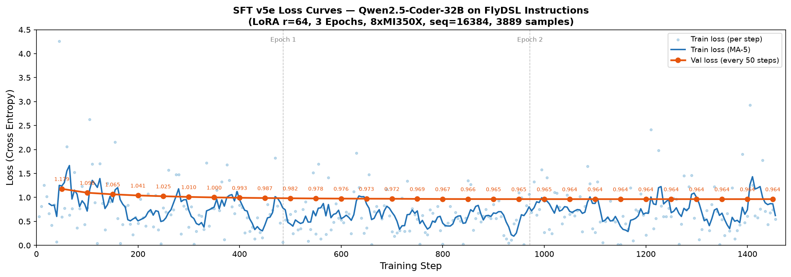

# SFT Training Process Record

## Training Decision

Based on the experimental conclusions from the CPT phase (see `../cpt/REPORT.md`), Qwen2.5-Coder-32B already has a very low base PPL (3.5) on FlyDSL code, and CPT instead caused catastrophic forgetting. Therefore **skip CPT and run SFT directly on the base model**.

## Environment

| Item | Configuration |
|------|------|
| GPU | 8× AMD Instinct MI350X (gfx950) |
| Base model | Qwen/Qwen2.5-Coder-32B (61GB, BF16) |
| Framework | PyTorch FSDP2 (`fully_shard`) + Lumen (`LumenConfig.enable()`) |
| LoRA | HuggingFace PEFT, r=32, alpha=64, dropout=0.1 |
| Checkpoint | `torch.distributed.checkpoint` (DCP) |
| Docker | `lumen/flydsl-cpt:latest` (reusing CPT image) |

## Dataset

| Split | Samples | Format |
|-------|--------|------|
| Train | 2,808 | ChatML (`system` + `user` + `assistant`) |
| Validation | 264 | Same as above |

SFT data source distribution:

| Source | Count | Description |
|------|------|------|
| augmentation_hardware | 766 | Hardware adaptation (gfx942↔gfx950↔gfx1250) |
| documentation_qa | 669 | Documentation Q&A |
| kernel_reverse_annotation | 388 | Code→instruction reverse annotation (3 styles) |
| ai_annotated_instruction | 375 | 5-model consensus annotation |
| refusal_boundary | 135 | Refusal boundary training |
| augmentation_tile | 105 | Tile configuration variants |
| test_parameterization | 89 | Test parameterization |
| git_history | 88 | Git commit analysis |
| augmentation_pipeline | 73 | Pipeline depth variants |
| Other | 120 | Performance improvements, skill Q&A, etc. |

## Training Configuration

| Parameter | Value | Source |
|------|------|------|
| Max steps | 527 | 2808 / GBS=16 × 3 epochs |
| GBS | 16 | MBS=1 × GPU=8 × grad_accum=2 |
| Sequence length | 8192 | |
| LR | 1e-5 | plan.md §7.3 |
| LR schedule | Cosine, warmup=26 steps (5%) | |
| Weight decay | 0.01 | |
| LoRA rank | 32 | plan.md §3 (SFT tasks are more focused) |
| LoRA alpha | 64 | alpha = 2 × rank |
| LoRA dropout | 0.1 | Regularization for small dataset |
| LoRA targets | q/k/v/o/gate/up/down_proj | All attention + MLP |
| Loss masking | answer-only | Only assistant tokens contribute to loss |
| Eval interval | 50 steps | |

Trainable parameters: 268,435,456 / 33,032,311,808 (0.81%)

## Smoke Test

5-step test passed validation:
- 2808 train + 264 val all loaded (0 skipped)
- step 5 loss=0.83 — reasonable range
- DCP checkpoint saved successfully

## Training Process

### Loss Curves



Training took about 57 minutes (07:46 ~ 08:44), ~6.5 seconds per step.

**Train loss** characteristics:
- High variance (min=0.21, max=3.67, std=0.77)
- Reason: high SFT data diversity (13 sources), simple doc Q&A loss~0.2, complex kernel code loss~3.6
- Overall downward trend: first half mean 1.32 → second half mean 1.22

**Validation loss** trend:

| Step | Val Loss | Phase |
|------|----------|------|
| 50 | 1.1512 | Rapid decline |
| 100 | 1.1018 | |
| 150 | 1.0721 | |
| 200 | 1.0532 | |
| 250 | 1.0411 | Converging |
| 300 | 1.0344 | |
| 350 | 1.0315 | Approaching plateau |
| **400** | **1.0302** | **Lowest point** |
| 450 | 1.0303 | Flat |
| 500 | 1.0304 | Slight rise → overfitting threshold |

### Convergence Analysis

Val loss improvement rate gradually decreasing:

| Interval | Δ Val Loss | Improvement Rate |
|------|-----------|--------|
| 50→100 | -0.0494 | 4.3% |
| 100→150 | -0.0297 | 2.7% |
| 150→200 | -0.0189 | 1.8% |
| 200→250 | -0.0121 | 1.1% |
| 250→300 | -0.0067 | 0.6% |
| 300→350 | -0.0029 | 0.3% |
| 350→400 | -0.0013 | 0.1% |
| 400→450 | +0.0001 | -0.01% |
| 450→500 | +0.0001 | -0.01% |

**Conclusion: 3 epochs is the optimal choice.** Val loss fully plateaus between epochs 2~3 (1.030); slight rise after step 450, further training would only overfit.

## Model Export

DCP checkpoint → HuggingFace format:

```
dcp_to_torch_save() → load_state_dict() → merge_and_unload() → save_pretrained()
```

- Input: `/home/danyzhan/sft-results/final/final/` (DCP, 8 shards)
- Output: `/home/danyzhan/sft-results/Qwen2.5-Coder-SFT/` (14 safetensors, 61GB)
- Key match: 1667/1667, LoRA_A non-zero: 224/224

## File Inventory

```
sft/
├── TRAINING.md          # This document
├── REPORT.md            # Benchmark analysis report
├── train_sft.py         # FSDP2 SFT training script
├── dataset.py           # ChatML dataset + answer-only loss mask
├── eval_sft.py          # 5-level difficulty benchmark script
├── config_sft.sh        # Training hyperparameter config
└── run_sft.sh           # Docker launch script
```

## Artifact Locations

| Artifact | Path |
|------|------|
| Training log | `/home/danyzhan/sft-results/train.log` |
| Loss curve plot | `sft_loss_curves.png` |
| DCP checkpoint | `/home/danyzhan/sft-results/final/final/` |
| HF model | `/home/danyzhan/sft-results/Qwen2.5-Coder-SFT/` |
| Benchmark plot | `sft_benchmark.png` |
| Benchmark JSON | `/home/danyzhan/sft-results/benchmark.json` |
