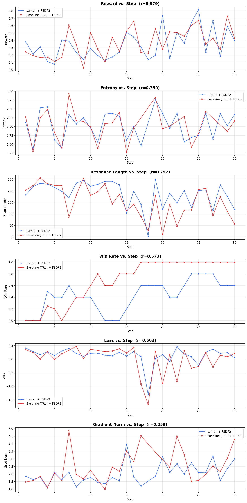

# Lumen + FSDP2 vs. Baseline (TRL) + FSDP2 Comparison

## Configuration

Both runs use identical training settings:

| Parameter | Value |
|---|---|
| Model | NousResearch/Llama-2-70b-hf |
| FSDP Version | 2 (fully_shard API) |
| Steps | 30 |
| Seed | 1234 |
| GPUs | 8 |
| Micro Batch Size | 1 |
| Grad Accum | 1 |
| Num Generations | 8 |
| Max Completion Length | 256 |
| Learning Rate | 5e-6 |
| Beta | 0.0 |

**Difference**: Lumen pre-builds the actor model with `build_actor_model()` (AutoModelForCausalLM + bf16 + sdpa + gradient checkpointing). Baseline passes the model name string directly to `GRPOTrainer`, letting TRL handle model construction.

## Entropy Outliers

Both runs exhibit bf16 numerical overflow in TRL's entropy computation under FSDP2:

| Run | Outlier Steps | Values |
|---|---|---|
| Lumen + FSDP2 | 18 | -1.3e7 |
| Baseline + FSDP2 | 17, 18, 22, 27, 28 | 4.9e11, 1.2e23, 1.1e14, 2.4e29, -7.5e28 |

The baseline has **more** entropy outliers (5 vs 1), confirming this is a TRL/bf16 issue in the FSDP2 code path, not caused by Lumen. All statistics below use MAD-based filtering to exclude these outliers.

## Results

| Metric | Lumen + FSDP2 Mean | Lumen + FSDP2 Std | Baseline + FSDP2 Mean | Baseline + FSDP2 Std | Pearson r |
|---|---|---|---|---|---|
| Mean Reward | 0.3382 | 0.1972 | 0.3679 | 0.1880 | 0.579 |
| Mean Length | 186.8 | 55.0 | 154.8 | 67.8 | 0.797 |
| Entropy* | 2.0380 | 0.3902 | 2.0282 | 0.4303 | 0.399 |
| Loss | 0.1371 | 0.3034 | 0.0130 | 0.4898 | 0.603 |
| Grad Norm* | 2.0207 | 0.6655 | 2.4713 | 1.0666 | 0.258 |
| Win Rate | 0.4233 | 0.2604 | 0.6817 | 0.3725 | 0.573 |

\* Filtered: Lumen excludes 1 outlier step, Baseline excludes 5 outlier steps.

## Interpretation

- **Reward (r=0.579)**: Moderate correlation — some stochastic divergence but the same overall reward trajectory (both improving from ~0.2 to ~0.4-0.7).
- **Response Length (r=0.797)**: Strong correlation — behavioral adaptation (shorter completions -> higher reward) is consistent.
- **Entropy (r=0.399)**: Moderate correlation — both runs show similar entropy ranges (1.2-2.9) after filtering, confirming similar policy behavior.
- **Grad Norm (r=0.258)**: Weak correlation — expected under FSDP2 where stochastic generation produces different gradient landscapes.
- **Win Rate (r=0.573)**: Moderate — both trend upward, but baseline reaches higher win rates due to slightly better reward improvement.
- Final reward: Lumen=0.3948, Baseline=0.4283 (comparable)
- Final length: Lumen=118.6, Baseline=56.1

## Conclusion

Lumen + FSDP2 and pure TRL + FSDP2 produce **qualitatively equivalent** training dynamics. The strong length correlation (r=0.80) and moderate reward correlation (r=0.58) confirm that Lumen's model building does not alter the fundamental GRPO optimization. The entropy overflow is a shared TRL/bf16 issue under FSDP2 — the baseline actually has more outliers (5) than Lumen (1).

## Files

| File | Description |
|---|---|
| `compare_curves.png` | Side-by-side 6-panel comparison plot (outliers filtered) |
| `grpo_curves.png` | Baseline FSDP2 standalone training curves |
| `grpo_eval_log.jsonl` | Raw baseline FSDP2 training metrics |
| `COMPARISON.md` | This document |
