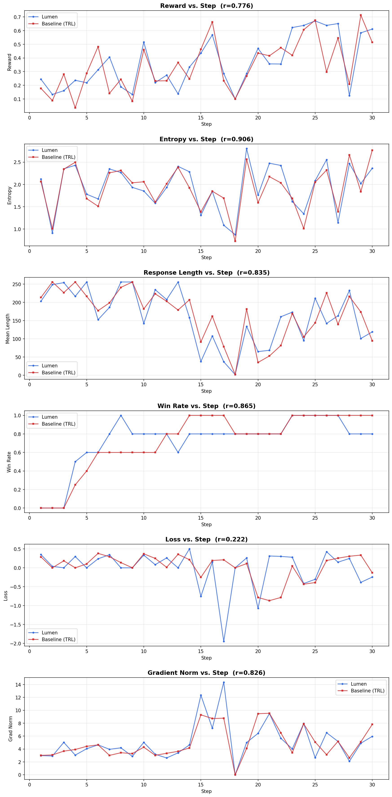

# Lumen vs. Baseline (TRL) Comparison

## Results

| Metric | Lumen Mean | Lumen Std | Baseline (TRL) Mean | Baseline (TRL) Std | Pearson r |
|---|---|---|---|---|---|
| Mean Reward | 0.3638 | 0.1862 | 0.3465 | 0.1842 | 0.776 |
| Mean Length | 162.5875 | 73.3245 | 166.3375 | 68.3283 | 0.835 |
| Entropy | 1.9346 | 0.5125 | 1.9147 | 0.4900 | 0.906 |
| Loss | -0.0178 | 0.4980 | 0.0201 | 0.3442 | 0.222 |
| Grad Norm | 5.0814 | 2.8982 | 4.9250 | 2.4031 | 0.826 |
| Win Rate | 0.7300 | 0.2722 | 0.7283 | 0.3135 | 0.865 |

## Interpretation

- **Reward Pearson r = 0.776**: Strong correlation — the two runs show the same reward learning trajectory.
- **Length Pearson r = 0.835**: Strong correlation — both runs show the same behavioral adaptation.
- Lumen final reward: 0.6113, Baseline (TRL) final reward: 0.5142
- Lumen final length: 119.0, Baseline (TRL) final length: 94.4

## Conclusion

Both runs produce equivalent training behavior, confirming consistent GRPO training dynamics.
