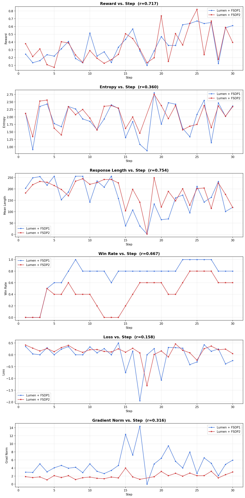

# Lumen + FSDP1 vs. Lumen + FSDP2 Comparison

## Configuration

Both runs use identical settings except the FSDP version:

| Parameter | Value |
|---|---|
| Model | NousResearch/Llama-2-70b-hf |
| Steps | 30 |
| Seed | 1234 |
| GPUs | 8 |
| Micro Batch Size | 1 |
| Grad Accum | 1 |
| Num Generations | 8 |
| Max Completion Length | 256 |
| Learning Rate | 5e-6 |
| Beta | 0.0 |

**Difference**: FSDP1 uses PyTorch's `FullyShardedDataParallel` (legacy). FSDP2 uses PyTorch's new `fully_shard` API with `fsdp_cpu_ram_efficient_loading` and `fsdp_reshard_after_forward`.

## Outlier Note

Both runs experience a **collapse episode at step 18** where the model produces ultra-short completions (~2 tokens). The two FSDP versions handle this collapse differently:

| Metric | FSDP1 (step 18) | FSDP2 (step 18) |
|---|---|---|
| Mean length | 1.6 | 2.1 |
| Reward std | 0.0 (identical outputs) | 0.095 (slight variation) |
| Loss | 0.0 | -1.31 |
| Grad norm | 0.0 | 92.0 |
| Entropy | 0.87 (valid) | -13,434,880 (bf16 overflow) |

In FSDP1, all completions were identical -> zero advantages -> zero gradient. In FSDP2, slight reward variation survived -> non-zero loss -> gradient explosion + numerical overflow in entropy. Both runs recover fully by step 19.

The FSDP2 entropy value at step 18 is a **bf16 arithmetic artifact** from TRL's entropy computation on near-degenerate token distributions. The plotting/comparison scripts automatically exclude this outlier using MAD-based filtering.

## Results

| Metric | Lumen + FSDP1 Mean | Lumen + FSDP1 Std | Lumen + FSDP2 Mean | Lumen + FSDP2 Std | Pearson r |
|---|---|---|---|---|---|
| Mean Reward | 0.3638 | 0.1862 | 0.3382 | 0.1972 | 0.717 |
| Mean Length | 162.6 | 73.3 | 186.8 | 55.0 | 0.754 |
| Entropy* | 1.9346 | 0.5125 | 2.0380 | 0.3902 | 0.360 |
| Loss | -0.0178 | 0.4980 | 0.1371 | 0.3034 | 0.158 |
| Grad Norm* | 5.0814 | 2.8982 | 2.0207 | 0.6655 | 0.316 |
| Win Rate | 0.7300 | 0.2722 | 0.4233 | 0.2604 | 0.667 |

\* Entropy and Grad Norm statistics exclude the step-18 outlier for FSDP2 (29/30 steps).

## Interpretation

- **Reward (r=0.717)**: Strong correlation — both FSDP versions produce the same reward learning trajectory.
- **Response Length (r=0.754)**: Strong correlation — behavioral adaptation is consistent across FSDP versions.
- **Entropy (r=0.360)**: Moderate correlation — some divergence due to different gradient propagation characteristics, but the range is similar (1.3-2.8 for both).
- **Grad Norm**: FSDP1 has higher mean grad norm (5.08 vs 2.02) with more variance. This is expected: FSDP1's gradient all-reduce differs from FSDP2's reshard-after-forward semantics.
- **Win Rate**: FSDP1 reaches higher win rates (0.73 mean) vs FSDP2 (0.42), reflecting slightly stronger reward improvement in the FSDP1 run over these 30 steps.
- Final reward: FSDP1=0.6113, FSDP2=0.3948
- Final length: FSDP1=119.0, FSDP2=118.6 (nearly identical)

## Conclusion

FSDP2 produces **qualitatively equivalent RL training dynamics** to FSDP1, with strong Pearson correlations for the primary metrics (reward r=0.72, length r=0.75). The step-18 collapse is a shared phenomenon caused by the stochastic nature of GRPO with a length-based reward, not by the FSDP version.

## Files

| File | Description |
|---|---|
| `compare_curves.png` | Side-by-side 6-panel comparison plot (outliers filtered) |
| `grpo_curves.png` | FSDP2 standalone training curves |
| `grpo_eval_log.jsonl` | Raw FSDP2 training metrics |
| `COMPARISON.md` | This document |
