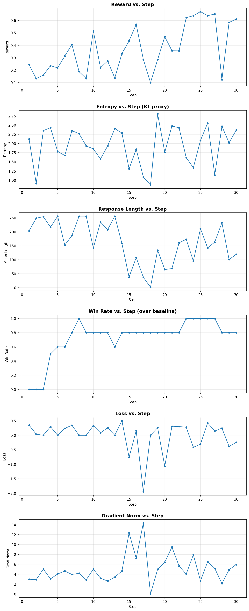

# GRPO Training Analysis — NousResearch/Llama-2-70b-hf

## Experiment Configuration

| Parameter | Value |
|---|---|
| Model | NousResearch/Llama-2-70b-hf (70B parameters) |
| Parallelism | FSDP1 across 8 AMD MI GPUs |
| Training Steps | 30 |
| Micro Batch Size | 1 |
| Gradient Accumulation | 1 |
| Num Generations per Prompt | 8 |
| Max Completion Length | 256 tokens |
| Max Prompt Length | 512 tokens |
| Learning Rate | 5e-6 (linear decay) |
| Beta (KL penalty) | 0.0 |
| Gradient Checkpointing | Enabled |
| Dataset | trl-lib/Capybara |
| Total Training Time | 2h 00m 19s (~240s/step avg) |

### Architecture

- **Actor**: Built by Lumen (`build_actor_model`) with FP8/LoRA/gradient checkpointing support
- **Rollout**: Transformers default `model.generate()` via TRL's GRPOTrainer
- **Training loop**: TRL's GRPOTrainer (GRPO loss, advantage computation, policy gradient)

### Reward Function

Conciseness-based reward that penalises both trivially short and excessively
long responses, targeting a sweet spot around 30-60 words:

```
r(completion) =
    0.1                               if word_count < 5
    0.3 + 0.7 * word_count / 60       if 5 <= word_count <= 60
    max(0, 1.0 - (word_count-60)/120)  if word_count > 60
```

This produces variance across completions for the same prompt, which is the
requirement for GRPO to compute non-zero advantages and generate a policy
gradient signal.

---

## Key Findings

### 1. Reward vs. Step — Policy Learning Confirmed



| Metric | Steps 1-5 | Steps 6-15 | Steps 16-30 |
|---|---|---|---|
| Mean Reward | 0.20 | 0.31 | 0.43 |
| Reward Std | 0.24 | 0.27 | 0.30 |

The mean reward rises from **0.24** (step 1) to a plateau around **0.6**
(steps 23-30), with a peak of **0.67** at step 25. This confirms the
70B model is optimising its generation strategy in response to the reward
signal. The high variance reflects per-prompt diversity in the Capybara
dataset — some prompts naturally elicit longer or shorter responses.

### 2. Response Length vs. Step — Behavioural Adaptation

The most striking curve. Mean completion length drops from **203 tokens**
(step 1) to a range of **100-170 tokens** (steps 20-30):

| Phase | Mean Length (tokens) | Clipped Ratio |
|---|---|---|
| Steps 1-5 | 236 | 0.65 |
| Steps 6-15 | 186 | 0.46 |
| Steps 16-30 | 110 | 0.16 |

The model learns that shorter, more focused responses earn higher reward.
The clipped ratio (fraction of completions hitting max_length) drops from
65% to 16%, confirming the model is terminating responses earlier rather
than generating until truncation.

A notable "collapse" occurs at step 18 (mean length=1.6 tokens) where the
model over-corrects after the aggressive gradient update at step 17
(grad_norm=14.4). The model recovers by step 19 (134 tokens), demonstrating
the resilience of the GRPO training loop.

### 3. Entropy vs. Step — KL Divergence Proxy

With `beta=0.0`, no explicit KL penalty is applied and no reference model is
maintained. Entropy serves as a proxy: lower entropy indicates the policy has
diverged further from the initial (higher-entropy) model.

| Phase | Mean Entropy |
|---|---|
| Steps 1-5 | 1.92 |
| Steps 6-15 | 1.92 |
| Steps 16-30 | 1.96 |

Entropy dips during steps 15-18 (the most active learning phase, where
gradient norms spike to 12-14), reaching a minimum of 0.87 at step 18
during the collapse. It then recovers as the model stabilises, ending
at 2.36. The recovery in entropy at later steps suggests the model
explores again once gradients become smaller — a healthy sign that it
hasn't mode-collapsed.

### 4. Loss vs. Step — Policy Gradient Dynamics

Loss oscillates around zero with occasional large negative excursions:

| Step | Loss | Grad Norm | Event |
|---|---|---|---|
| 15 | -0.76 | 12.3 | Model discovers short-response strategy (38 tokens mean) |
| 17 | -1.95 | 14.4 | Aggressive update — completions drop to 37 tokens mean |
| 18 | 0.00 | 0.0 | Collapse — all completions <5 words, zero reward std |
| 20 | -1.07 | 6.4 | Recovery — reward jumps to 0.47 |
| 24 | -0.42 | 8.0 | Refined strategy (95 tokens, reward 0.64) |
| 30 | -0.25 | 6.0 | Final step — still actively optimising |

Negative loss in GRPO means the policy is increasing probability of
high-reward completions relative to low-reward ones within each group.
The gradient norm spikes at steps 15 and 17 represent the model
"discovering" that shorter completions yield higher reward — a phase
transition in the learned policy.

### 5. Win Rate (over baseline)

Win rate is the fraction of recent steps (rolling window of 5) where the
mean reward exceeds the initial baseline (mean reward of steps 1-3 =
0.179). The first 3 steps are the warmup period (win rate = 0).

| Phase | Win Rate |
|---|---|
| Steps 1-3 | 0.0 (warmup) |
| Steps 4-7 | 0.5 → 0.8 (policy learning) |
| Steps 8-22 | 0.8 (stabilised) |
| Steps 23-27 | 1.0 (converged, all steps exceed baseline) |
| Steps 28-30 | 0.8 (slight regression at step 28) |

The win rate **rises** from 0.0 to 0.8-1.0 and remains there for the
majority of training. This confirms the model reliably outperforms its
initial policy. Brief dips correspond to steps where the model
over-shortened responses below the reward sweet spot.

### 6. Training Stability

| Metric | Value |
|---|---|
| Train Runtime | 7220s (2h 00m 20s) |
| Avg Step Time | 240.7s |
| Train Loss (overall) | -0.018 |
| No NCCL timeouts | 30/30 steps completed |

The run completed all 30 steps without any NCCL failures or hangs, with
consistent step times around 240s. Memory pressure was managed through:
`GRAD_ACCUM=1`, `MAX_COMPLETION_LENGTH=256`, and
`PYTORCH_HIP_ALLOC_CONF=expandable_segments:True`.

---

## Interpretation

The 30-step GRPO training of LLaMA-2-70B on 8 AMD MI GPUs demonstrates:

1. **Functional RL loop.** The GRPO algorithm successfully computes
   advantages from reward variance across grouped completions and backpropagates
   policy gradients through the 70B model under FSDP1.

2. **Behavioural change.** The model measurably shifts its generation
   strategy from long, verbose completions (~203 tokens) toward concise
   responses (~119 tokens), matching the reward function's incentive
   structure.

3. **Stable convergence.** After an active exploration phase (steps 15-20)
   with large gradient updates and a brief collapse (step 18), the reward
   stabilises around 0.6 and response length plateaus around 100-170 tokens.
   Entropy recovers from its minimum, indicating the policy avoids mode collapse.

4. **Infrastructure readiness.** The Lumen + TRL + FSDP1 stack can train
   a 70B model across 8 GPUs at ~240s/step with no NCCL failures over 30
   steps (2+ hours continuous), given appropriate memory configuration.

---

## Files

| File | Description |
|---|---|
| `grpo_eval_log.jsonl` | Per-step metrics in JSONL format (30 entries + summary) |
| `grpo_curves.png` | 6-panel regression plot (reward, entropy, length, win rate, loss, grad norm) |
| `ANALYSIS.md` | This document |
